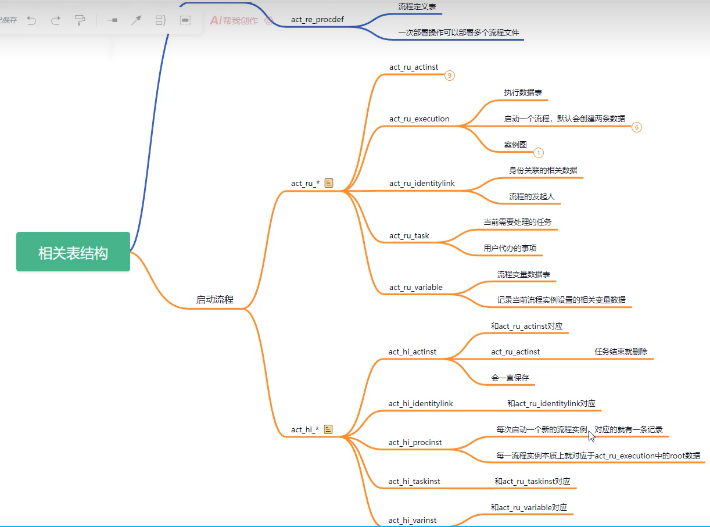

# Activiti 

官网：[开源业务自动化 |活动 (activiti.org)](https://www.activiti.org/)

是BPMN的一个基于java的软件实现，还包含了DMN决策和CMMN Case管理引擎，并且有自己的用户管理，微服务API等一系列功能，是一个服务平台

- BPM 业务流程管理

- BPM软件就是根据企业中业务环境的变化，推进人与人之间、人与系统之间以及系统与系统之间的整合及调整的经营方法与解决方案的IT工具
- Bpmn图是用xml表示业务流程（.bpmn文件就是业务流程定义文件，通过xml定义业务流程。）

## 创建SpringBoot项目

- 依赖（兼容jdk8）

```xml
 <dependency>
            <groupId>org.activiti</groupId>
            <artifactId>activiti-engine</artifactId>
            <version>6.0.0</version>
        </dependency>
```

- activity.cfg.xml

```xml
<?xml version="1.0" encoding="UTF-8"?>

<beans xmlns="http://www.springframework.org/schema/beans"
       xmlns:xsi="http://www.w3.org/2001/XMLSchema-instance"
       xsi:schemaLocation="http://www.springframework.org/schema/beans   http://www.springframework.org/schema/beans/spring-beans.xsd">

    <bean id="processEngineConfiguration"
          class="org.activiti.engine.impl.cfg.StandaloneProcessEngineConfiguration">

        <property name="jdbcUrl" value="jdbc:mysql://localhost:3306/activiti7?nullCatalogMeansCurrent=true"/>
        <property name="jdbcDriver" value="com.mysql.cj.jdbc.Driver"/>
        <property name="jdbcUsername" value="root"/>
        <property name="jdbcPassword" value="123456"/>
        <!-- Database configurations -->
        <property name="databaseSchemaUpdate" value="true"/>
        <property name="asyncExecutorActivate" value="false"/>
        <!-- mail server configurations -->
        <property name="mailServerPort" value="5025"/>
    </bean>

</beans>

```

- 启动实例 ：ProcessInstance

```java
   ProcessEngine processEngine= ProcessEngines.getDefaultProcessEngine();
```


## 连接数据库，创建相关表

```java
 ProcessEngine processEngine = ProcessEngineConfiguration
                .createStandaloneProcessEngineConfiguration()
                .setJdbcDriver("com.mysql.cj.jdbc.Driver")  // 设置数据库驱动程序类名
                .setJdbcUrl("jdbc:mysql://localhost:3306/activiti7?characterEncoding=utf8&serverTimezone=Asia/Shanghai&nullCatalogMeansCurrent=true")  // 设置数据库连接字符串
                .setJdbcUsername("root")
                .setJdbcPassword("123456")
                // 设置自动维护表结构
                .setDatabaseSchemaUpdate(ProcessEngineConfiguration.DB_SCHEMA_UPDATE_TRUE)
                .buildProcessEngine();
        System.out.println(processEngine);
```


### 引入自定义流程

```xml
<?xml version="1.0" encoding="UTF-8"?>
<definitions xmlns="http://www.omg.org/spec/BPMN/20100524/MODEL" xmlns:xsi="http://www.w3.org/2001/XMLSchema-instance" xmlns:xsd="http://www.w3.org/2001/XMLSchema" xmlns:activiti="http://activiti.org/bpmn" xmlns:bpmndi="http://www.omg.org/spec/BPMN/20100524/DI" xmlns:omgdc="http://www.omg.org/spec/DD/20100524/DC" xmlns:omgdi="http://www.omg.org/spec/DD/20100524/DI" typeLanguage="http://www.w3.org/2001/XMLSchema" expressionLanguage="http://www.w3.org/1999/XPath" targetNamespace="http://www.activiti.org/processdef">
    <process id="simple-leave01" name="simple-leave01" isExecutable="true">
        <documentation>simple-leave01</documentation>
        <startEvent id="startEvent1"></startEvent>
        <userTask id="sid-0619E151-6EC2-4534-B6AD-85A66EBFF31A" name="人事审批" activiti:assignee="zhangsan">
            <extensionElements>
                <modeler:initiator-can-complete xmlns:modeler="http://activiti.com/modeler"><![CDATA[false]]></modeler:initiator-can-complete>
            </extensionElements>
        </userTask>
        <endEvent id="sid-5EF667B5-238F-4DA2-A05A-6FDC5983AE35"></endEvent>
        <sequenceFlow id="sid-67D5D114-DF6E-45F7-9292-35DF4741CA95" sourceRef="startEvent1" targetRef="sid-0619E151-6EC2-4534-B6AD-85A66EBFF31A"></sequenceFlow>
        <userTask id="sid-B83BA73E-228C-4E77-A950-66B32DDF1275" name="经理审批" activiti:assignee="lisi">
            <extensionElements>
                <modeler:initiator-can-complete xmlns:modeler="http://activiti.com/modeler"><![CDATA[false]]></modeler:initiator-can-complete>
            </extensionElements>
        </userTask>
        <sequenceFlow id="sid-5236D6CD-5C9B-44E3-9691-9C26624E6089" sourceRef="sid-0619E151-6EC2-4534-B6AD-85A66EBFF31A" targetRef="sid-B83BA73E-228C-4E77-A950-66B32DDF1275"></sequenceFlow>
        <sequenceFlow id="sid-44780733-8CAC-4BC4-A9C1-E26CE5F1F8A8" sourceRef="sid-B83BA73E-228C-4E77-A950-66B32DDF1275" targetRef="sid-5EF667B5-238F-4DA2-A05A-6FDC5983AE35"></sequenceFlow>
    </process>
    <bpmndi:BPMNDiagram id="BPMNDiagram_test1">
        <bpmndi:BPMNPlane bpmnElement="test1" id="BPMNPlane_test1">
            <bpmndi:BPMNShape bpmnElement="startEvent1" id="BPMNShape_startEvent1">
                <omgdc:Bounds height="30.0" width="29.999999999999986" x="100.00000274166898" y="115.00000281021073"></omgdc:Bounds>
            </bpmndi:BPMNShape>
            <bpmndi:BPMNShape bpmnElement="sid-0619E151-6EC2-4534-B6AD-85A66EBFF31A" id="BPMNShape_sid-0619E151-6EC2-4534-B6AD-85A66EBFF31A">
                <omgdc:Bounds height="80.00000000000001" width="99.99999999999997" x="180.00000246750207" y="90.00000123375104"></omgdc:Bounds>
            </bpmndi:BPMNShape>
            <bpmndi:BPMNShape bpmnElement="sid-5EF667B5-238F-4DA2-A05A-6FDC5983AE35" id="BPMNShape_sid-5EF667B5-238F-4DA2-A05A-6FDC5983AE35">
                <omgdc:Bounds height="27.999999999999986" width="28.0" x="495.0000067856307" y="116.00001518884703"></omgdc:Bounds>
            </bpmndi:BPMNShape>
            <bpmndi:BPMNShape bpmnElement="sid-B83BA73E-228C-4E77-A950-66B32DDF1275" id="BPMNShape_sid-B83BA73E-228C-4E77-A950-66B32DDF1275">
                <omgdc:Bounds height="80.0" width="100.0" x="330.0000090475077" y="90.0000024675021"></omgdc:Bounds>
            </bpmndi:BPMNShape>
            <bpmndi:BPMNEdge bpmnElement="sid-67D5D114-DF6E-45F7-9292-35DF4741CA95" id="BPMNEdge_sid-67D5D114-DF6E-45F7-9292-35DF4741CA95">
                <omgdi:waypoint x="130.00000274166896" y="130.00000260458555"></omgdi:waypoint>
                <omgdi:waypoint x="180.00000246750207" y="130.0000019191683"></omgdi:waypoint>
            </bpmndi:BPMNEdge>
            <bpmndi:BPMNEdge bpmnElement="sid-5236D6CD-5C9B-44E3-9691-9C26624E6089" id="BPMNEdge_sid-5236D6CD-5C9B-44E3-9691-9C26624E6089">
                <omgdi:waypoint x="280.00000246750204" y="130.0000016450014"></omgdi:waypoint>
                <omgdi:waypoint x="330.0000090475077" y="130.00000205625176"></omgdi:waypoint>
            </bpmndi:BPMNEdge>
            <bpmndi:BPMNEdge bpmnElement="sid-44780733-8CAC-4BC4-A9C1-E26CE5F1F8A8" id="BPMNEdge_sid-44780733-8CAC-4BC4-A9C1-E26CE5F1F8A8">
                <omgdi:waypoint x="430.0000090475077" y="130.00000739825603"></omgdi:waypoint>
                <omgdi:waypoint x="495.0000067856308" y="130.0000138082359"></omgdi:waypoint>
            </bpmndi:BPMNEdge>
        </bpmndi:BPMNPlane>
    </bpmndi:BPMNDiagram>
</definitions>

```

- 部署流程

```java
 //获取引擎对象
        ProcessEngine processEngine=ProcessEngines.getDefaultProcessEngine();

        // 完成流程的部署
        RepositoryService repositoryService=processEngine.getRepositoryService();

        //完成部署操作
        Deployment deploy = repositoryService.createDeployment()
                .addClasspathResource("flow/simple-leave01.bpmn20.xml")
                .name("第一个流程")
                .deploy();//得到部署对象

        System.out.println(deploy.getId());
        System.out.println(deploy.getName());
```

- 查询表数据

````java
ProcessEngine processEngine=ProcessEngines.getDefaultProcessEngine();
        RepositoryService repositoryService=processEngine.getRepositoryService();
        //查询有哪些部署的流程--》 查询相关的流程定义信息
        //repositoryService.createDeploymentQuery() //查询流程部署相关的信息
        //repositoryService.createProcessDefinitionQuery() //查询部署的流程的相关定义
        List<Deployment> list = repositoryService.createDeploymentQuery().list();//查询所有的部署信息
        for (Deployment deployment : list) {
            System.out.println(deployment.getId());
            System.out.println(deployment.getName());
        }

        List<ProcessDefinition> list1 = repositoryService.createProcessDefinitionQuery().list();
        for (ProcessDefinition processDefinition : list1) {
            System.out.println(processDefinition.getId());
            System.out.println(processDefinition.getName());
            System.out.println(processDefinition.getDescription());
        }

输出：
1
第一个流程
simple-leave01:1:4
simple-leave01
simple-leave01

````

- 查询执行人的代办任务

```java
 ProcessEngine processEngine=ProcessEngines.getDefaultProcessEngine();
        //代办查询
        TaskService taskService = processEngine.getTaskService();
        List<Task> list = taskService.createTaskQuery().taskAssignee("lisi").list();
        if (!list.isEmpty()) {
            for (Task task : list) {
                System.out.println(task);
            }
            return;
        }
```

- 执行代办任务

执行代办任务后，就到下一个流程

```java
 ProcessEngine processEngine=ProcessEngines.getDefaultProcessEngine();
        //执行任务审批 需要TaskService 实现
        TaskService taskService = processEngine.getTaskService();
        //根据当前登录用户查询对应的代办信息
        //从数据库中获取待办的id 完成任务
        //执行这个后就到下一个节点
        //taskService.complete("2505");
    }
```

## 表结构

activiti相关的表都是act开头的

**re**开头的表表示资源信息

**ru**表示存储运行的信息

**id**包含用户身份信息

**hi**存储历史数据

**ge**用用数据

- act_re_deployment 流程部署表
  - 一次部署产生一张表记录
- act_re_procdef 流程定义表
  - 一张流程图对应的表记录
- act_hi_procinst 流程实例表
  -  发起一个流程就会创建对应的记录
- act_ru_task 代办记录表 
  - 当前需要审批记录的表，节点审批后就会被删除

- act_hi_actinst 历史记录表
  - 流程审批节点的记录信息
- act_hi_taskinst 任务实例记录表

