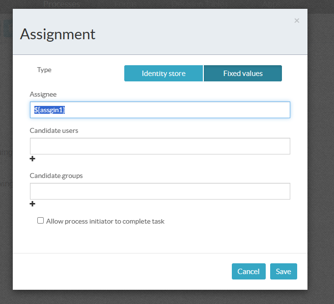
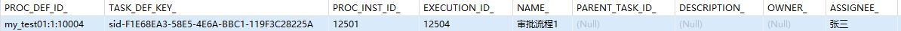
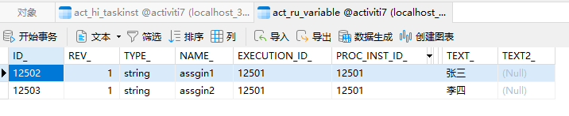
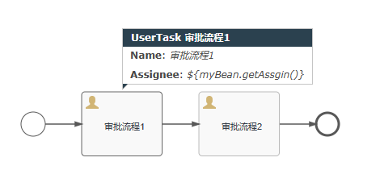
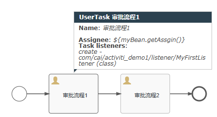
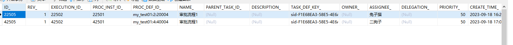

# 流程设计持久化

## 任务分配

### 固定分配

#### 表达式

##### 值表达式



```java
 void test1(){
        ProcessEngine processEngine= ProcessEngines.getDefaultProcessEngine();
        // 部署流程操作
        RepositoryService repositoryService = processEngine.getRepositoryService();
        // 执行部署操作
        Deployment deploy = repositoryService.createDeployment()
                .addClasspathResource("flow/my_test01.bpmn20.xml")
                .name("流程操作-流程变量")
                .deploy();
        System.out.println(deploy.getId());
        System.out.println(deploy.getName());
    }
```

```java
void test2(){
        ProcessEngine processEngine=ProcessEngines.getDefaultProcessEngine();
        RuntimeService runtimeService = processEngine.getRuntimeService();
        //对流程变量进行赋值
        Map<String,Object> map=new HashMap<>();
        map.put("assgin1","张三");
        map.put("assgin2","李四");

        //获取流程id启动流程
        ProcessInstance processInstance = runtimeService
                .startProcessInstanceById("my_test01:1:10004",map);

        System.out.println("processInstance.getId() = " + processInstance.getId());
        System.out.println("processInstance.getDeploymentId() = " + processInstance.getDeploymentId());
        System.out.println("processInstance.getDescription() = " + processInstance.getDescription());
    }
// 输出
processInstance.getId() = 12501
processInstance.getDeploymentId() = null
processInstance.getDescription() = null
```



流程变量表



审批

```java
void test3(){
        ProcessEngine processEngine=ProcessEngines.getDefaultProcessEngine();

        TaskService taskService = processEngine.getTaskService();

        List<Task> taskList = taskService.createTaskQuery().taskAssignee("张三").list();
        for (Task task : taskList) {
            //执行审批任务
            taskService.complete(task.getId());
        }
    }
```

##### 方法表达式

可以不用添加变量信息，通过方法来赋值

```java
<?xml version="1.0" encoding="UTF-8"?>

<beans xmlns="http://www.springframework.org/schema/beans"
       xmlns:xsi="http://www.w3.org/2001/XMLSchema-instance"
       xsi:schemaLocation="http://www.springframework.org/schema/beans   http://www.springframework.org/schema/beans/spring-beans.xsd">

    <bean class="com.cai.activiti_demo1.service.MyBean" name="myBean"/>

    <bean id="processEngineConfiguration"
          class="org.activiti.engine.impl.cfg.StandaloneProcessEngineConfiguration">

        <property name="jdbcUrl" value="jdbc:mysql://localhost:3306/activiti7?nullCatalogMeansCurrent=true"/>
        <property name="jdbcDriver" value="com.mysql.cj.jdbc.Driver"/>
        <property name="jdbcUsername" value="root"/>
        <property name="jdbcPassword" value="123456"/>
        <!-- Database configurations -->
        <property name="databaseSchemaUpdate" value="true"/>
        <property name="asyncExecutorActivate" value="false"/>
        <!-- mail server configurations -->
        <property name="mailServerPort" value="5025"/>
    </bean>

</beans>

```

myBean

```java
package com.cai.activiti_demo1.service;

import lombok.extern.slf4j.Slf4j;

@Slf4j
public class MyBean {
    public String getAssgin(){
        log.debug("执行了【MyBean.getAssgin()】");
        return "兔子猫";
    }
}

```

执行流程

```java
    @Test
    void test1(){
        ProcessEngine processEngine= ProcessEngines.getDefaultProcessEngine();
        // 部署流程操作
        RepositoryService repositoryService = processEngine.getRepositoryService();
        // 执行部署操作
        Deployment deploy = repositoryService.createDeployment()
                .addClasspathResource("flow/my_test02.bpmn20.xml")
                .name("流程操作-流程变量-2")
                .deploy();
        System.out.println(deploy.getId());
        System.out.println(deploy.getName());
    }

    @Test
    void test2(){
        ProcessEngine processEngine=ProcessEngines.getDefaultProcessEngine();
        RuntimeService runtimeService = processEngine.getRuntimeService();
        //获取流程id启动流程
        ProcessInstance processInstance = runtimeService
                .startProcessInstanceById("my_test01:2:20004");

        System.out.println("processInstance.getId() = " + processInstance.getId());
        System.out.println("processInstance.getDeploymentId() = " + processInstance.getDeploymentId());
        System.out.println("processInstance.getDescription() = " + processInstance.getDescription());
    }

```



## 监听器配置



```java
@Slf4j
public class MyFirstListener implements TaskListener {
    /**
     * 监听器触发回调方法
     * @param delegateTask
     */
    @Override
    public void notify(DelegateTask delegateTask) {
      log.debug("执行了自定义监听器【MyFirstListener.notify()】");
      if (EVENTNAME_CREATE.equals(delegateTask.getEventName())){
          //表示当前的task的创建事件触发了
          //task为节点的处理人
          delegateTask.setAssignee("二狗子");
      }
    }
}
```

执行上面流程

```java
@Test
    void test1(){
        ProcessEngine processEngine= ProcessEngines.getDefaultProcessEngine();
        // 部署流程操作
        RepositoryService repositoryService = processEngine.getRepositoryService();
        // 执行部署操作
        Deployment deploy = repositoryService.createDeployment()
                .addClasspathResource("flow/my_test3.bpmn20.xml")
                .name("流程操作-流程变量-3")
                .deploy();
        System.out.println(deploy.getId());
        System.out.println(deploy.getName());
    }

    @Test
    void test2(){
        ProcessEngine processEngine=ProcessEngines.getDefaultProcessEngine();
        RuntimeService runtimeService = processEngine.getRuntimeService();
        //获取流程id启动流程
        ProcessInstance processInstance = runtimeService
                .startProcessInstanceById("my_test01:4:40004");

        System.out.println("processInstance.getId() = " + processInstance.getId());
        System.out.println("processInstance.getDeploymentId() = " + processInstance.getDeploymentId());
        System.out.println("processInstance.getDescription() = " + processInstance.getDescription());
    }
```



待办中的处理人就是监听器的值