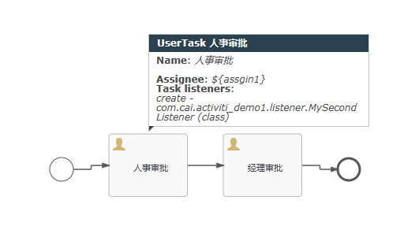

# 流程变量

把数据添加到流程的运行时状态中。改变实体各种API可以用来更新附加的变量

*在活动activity中设置了一个变量，后续活动中可以通过使用这个名称来访问，变量值为java对象*

## 运行时变量

- 流程实例运行变量存在 *act_ru_variable* 中，流程运行结束，该实例的变量在表中删除。


创建流程



创建两个监听器

...

----

全局变量

其他的节点可以获取到这个变量

```java
RuntimeService runtimeService = engine.getRuntimeService();
runtimeService.setVariableLocal("2507","price",688.88);
runtimeService.setVariableLocal("2507","orderId","test10001");
```

局部变量

只有当前节点可以获取到变量

```java
TaskService taskService = engine.getTaskService();
taskService.setVariableLocal("2510","wechat","cai857826959");
```


变量的获取

```java
//获取全局变量
ProcessEngine engine=ProcessEngines.getDefaultProcessEngine();
RuntimeService runtimeService = engine.getRuntimeService();
Map<String, Object> variablesLocal = runtimeService.getVariablesLocal("2507");
System.out.println(variablesLocal);
```

查看历史数据

```java
ProcessEngine processEngine=ProcessEngines.getDefaultProcessEngine();
//查询所有工作流的历史数据 HistoryService
HistoryService historyService=processEngine.getHistoryService();
List<HistoricVariableInstance> list = historyService.createHistoricVariableInstanceQuery().list();
for (HistoricVariableInstance historicVariableInstance : list) {
    System.out.println(historicVariableInstance);
}
```
