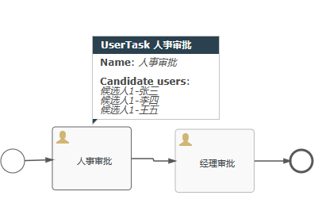
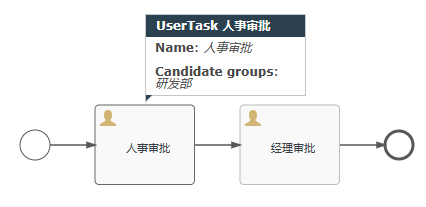

# 身份

针对任务节点 assignee 固定设置任务负责人

## 审批人


## 候选人



- 拾取

拾取：候选人拾取审核操作，其他候选人就无法再次拾取

```java
 @Test
    void test3(){
        String username="候选人2-wang";
        //候选人审批任务
        ProcessEngine processEngine=ProcessEngines
            .getDefaultProcessEngine();
        TaskService taskService = processEngine.getTaskService();
        //根据候选人查询审批任务
        List<Task> taskList = taskService
                .createTaskQuery()
                .taskCandidateUser(username)
                .list();
        if (taskList.isEmpty()){
            System.out.println("审批任务为空");
            return;
        }
        System.out.println(taskList);

        //当候选人发现有任务的时候需要拾取才能变为处理人
        //任务被候选人中的一个人拾取任务后，当前节点的其他候选人查询不到
        for (Task task : taskList) {
            taskService.claim(task.getId(),username);
        }
    }
```

- 归还

归还：拾取的用户放弃审批操作，其他候选人可以重新拾取任务

```java
    @Test
    void test4(){
        String username="候选人1-李四";
        ProcessEngine processEngine=ProcessEngines
            .getDefaultProcessEngine();
        TaskService taskService = processEngine.getTaskService();
        // 根据审批人或者待办人查询审批任务
        List<Task> list = taskService
                .createTaskQuery()
                .taskCandidateOrAssigned(username).list();
        if (list.isEmpty()){
            System.out.println("当前审批人代办任务为空");
            return;
        }
        System.out.println(list);

        //归还操作
        for (Task task : list) {
            taskService.unclaim(task.getId());
        }
    }
```

- 审批

```java
@Test
    void test5(){
        String username="候选人2-wang";
        ProcessEngine processEngine=ProcessEngines
            .getDefaultProcessEngine();
        TaskService taskService = processEngine.getTaskService();
        List<Task> list = taskService.createTaskQuery().taskCandidateOrAssigned(username).list();
        if (list.isEmpty()){
            System.out.println("选择审核或候选人没有代办任务");
            return;
        }
        for (Task task : list) {
            taskService.complete(task.getId());
        }
        System.out.println("审批完成");
    }
```

## 候选人组

候选人很多的情况下，进行分组处理，先创建分组，然后把用户分配到这个组中



候选人组审批流程：当用户1登录系统，查询用户1当前所在的部门，再根据当前部门查询待办的任务

- 候选人组的任务的拾取

```java
@Test
    void test3(){
        String groupName="研发部";
        //候选人审批任务
        ProcessEngine processEngine=ProcessEngines.getDefaultProcessEngine();
        TaskService taskService = processEngine.getTaskService();
        //根据候选人查询审批任务
        List<Task> taskList = taskService
                .createTaskQuery()
                .taskCandidateGroup(groupName)
                .list();
        if (taskList.isEmpty()){
            System.out.println("审批任务为空");
            return;
        }
        System.out.println(taskList);

        //当候选人发现有任务的时候需要拾取才能变为处理人
        //任务被候选人中的一个人拾取任务后，当前节点的其他候选人查询不到
        for (Task task : taskList) {
            taskService.claim(task.getId(),"研发部-狗哥");
            System.out.println("【研发部-狗哥】拾取任务");
        }
    }
```

- 候选人组任务的归还

```java
    @Test
    void test4(){
        ProcessEngine processEngine=ProcessEngines.getDefaultProcessEngine();
        TaskService taskService = processEngine.getTaskService();
        // 根据审批人或者待办人查询审批任务
        List<Task> list = taskService
                .createTaskQuery()
                .taskAssignee("研发部-狗哥").list();
        if (list.isEmpty()){
            System.out.println("当前审批人代办任务为空");
            return;
        }
        System.out.println(list);

        //归还操作
        for (Task task : list) {
            taskService.unclaim(task.getId());
        }
        System.out.println("【研发部-狗哥】放弃审批");

    }
```

- 待办任务的交接

```java
@Test
    void test6(){
        ProcessEngine processEngine=ProcessEngines.getDefaultProcessEngine();
        TaskService taskService = processEngine.getTaskService();
        List<Task> list = taskService.createTaskQuery().taskAssignee("研发部-狗哥").list();
        if (list.isEmpty()) {
            System.out.println("当前处理人待任务为空");
            return;
        }
        for (Task task : list) {
            taskService.setAssignee(task.getId(),"研发部-猫弟");
            System.out.println("当前待办任务已交接给【研发部-猫弟】");
        }
    }
```

- 审批

```java
@Test
    void test5(){
        String username="研发部-猫弟";
        ProcessEngine processEngine=ProcessEngines.getDefaultProcessEngine();
        TaskService taskService = processEngine.getTaskService();
        List<Task> list = taskService.createTaskQuery().taskCandidateOrAssigned(username).list();
        if (list.isEmpty()){
            System.out.println("选择审核或候选人没有代办任务");
            return;
        }
        for (Task task : list) {
            taskService.complete(task.getId());
        }
        System.out.println("审批完成");
    }
```

