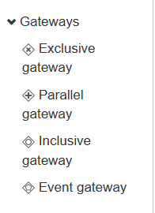
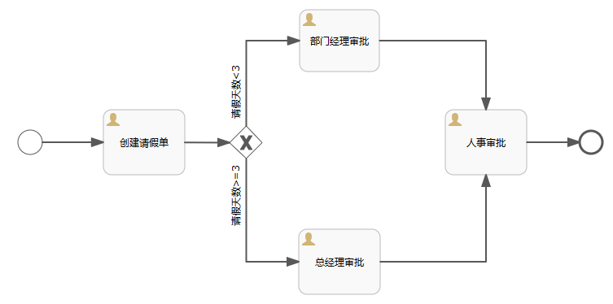
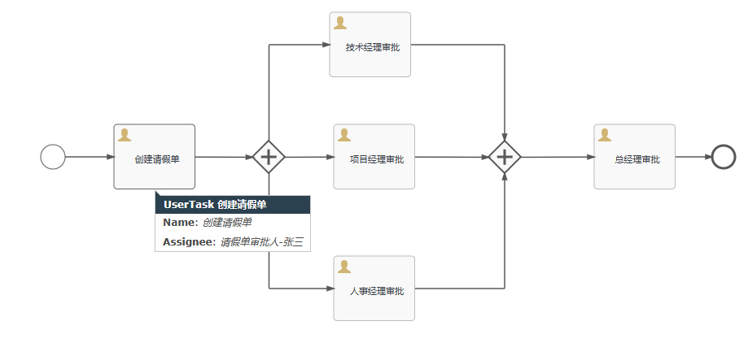
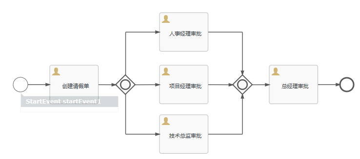

# 网关（路由）

## 简述

> 控制流程的执行流向、用于拆分或合并发咋的流程场景

- 排他网关 Exlusive gateway
  - 流程中进行条件判断，根据不同的条件的选择不同的分支路径，满足条件的分支会被执行
- 并行网关 Parallel gateway
  - 把流程分成多个并行的分支，分支可以同时执行，所有的分支执行完毕后。流程才会继续向下执行
- 包容网关 inclusive gateway
  - 根据多个条件的组合情况选择分支路径，可以选择满足任意一个条件的分支执行，或满足所有条件的分支执行
- 事件网关 Event gateway
  - 根据事件的触发选择分支路径，指定的事件触发时，流程会选择对应的分支执行




### 排他网关



- 创建请假单流程

```java
    /**
     * 创建请假单任务
     */
    @Test
    void test3(){
        ProcessEngine processEngine=ProcessEngines.getDefaultProcessEngine();
        TaskService taskService = processEngine.getTaskService();
        List<Task> taskList = taskService.createTaskQuery().taskAssignee("二狗子").list();
        if (taskList.isEmpty()) {
            System.out.println("当人用户没有代办任务");
            return;
        }
        //绑定请假天数
        Map<String,Object> map=new HashMap<>();
        map.put("days",30);
        for (Task task : taskList) {
            taskService.complete(task.getId(),map);
            System.out.println("taskId: "+task.getId()+"当前申请请假天数："+map.get("days").toString()+"天");
        }
    }
```

根据天数按照不同的条件跳转到不同的节点


### 并行网关



- 主流程实例：流程启动就会维护的一条记录，`act_ru_execution`中的`parent_id`为null的记录

- 子流程实例：流程的每一步操作，都会更新子流程实例，表示当前流程的进度。如果进入的是并行网关。案例中的网关会产生3个子流程和一个主流程

**操作**

*和上面的代码几乎一样，主要就是流程上的区别*

```java
@Test
    void test3(){
        ProcessEngine processEngine=ProcessEngines.getDefaultProcessEngine();
        TaskService taskService = processEngine.getTaskService();
        List<Task> taskList = taskService.createTaskQuery().taskAssignee("总经理审批人-田七").list();
        if (taskList.isEmpty()) {
            System.out.println("当人用户没有代办任务");
            return;
        }
        for (Task task : taskList) {
            taskService.complete(task.getId());
        }
    }
```

### 包容网关



- 可以走人事审批 没有请假天数限制
- 可以走项目经理审批请假天数大于等于三天
- 可以周技术总监审批请假天数小于三天
