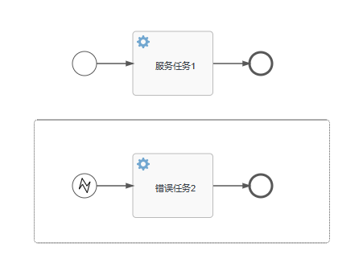

# 事件

用于流程声明中周期中发生的事情建模，用圆圈表示。事件的分类包含：捕获（catching）与 抛出（throwing）

- 捕获：流程执行到达这个时间的时候，会等待知道触发器触发动作。（触发器内部白色）
- 抛出：流程执行到达这个事件的时候，会触发一个触发器。（触发器内部黑色）

## 定时器事件

在特定时间触发的时间，在Activiti中，可以通过定时器时间来实现执行某个任务或者触发某个流程实例。具体包括定时器启动时间，定时器捕获中间事件，定时器边界事件在很多业务场景中

### 定时器开始事件

`timer start event` 在指定时间创建流程实例，在流程只需要启动依次，或者流程需要再特定的时间重复启动，可以使用

- 子流程不能有定时器启动事件

- 定时器启动事件中，在流程部署的同时就开始计时，不需要调用startProcessInstanceBy....就会启动，如果调用了就会额外开启一个流程
- 部署带有定时器启动事件的流程的更新版本时，上一个版本的定时器会被移除
- asynExecutorActivate需要设置成`true`否则定时器不生效，（开启异步任务）

**定时器开始事件属性**

- timeData
  - 指定一个具体的日期和事件，格式：`2022-01-01T00:00:00`
- timeCycle
  - 指定一个重复周期，格式：`R/PT1H`（每小时触发一次）
- timeDuration
  - 指定一个持续时间，格式：`PT2H30M`（持续2小时30分）


activiti.cfg.xml

```xml
<property name="asyncExecutorActivate" value="true"/>
```

```java
 @Test
    void test1() throws InterruptedException {
        ProcessEngine processEngine = ProcessEngines.getDefaultProcessEngine();
        //部署
        RepositoryService repositoryService = processEngine.getRepositoryService();
        Deployment deploy = repositoryService
                .createDeployment()
                .addClasspathResource("flow/TimerEvent.bpmn20.xml")
                .name("开始事件定时器")
                .deploy();
        System.out.println(deploy.getId());
        System.out.println(deploy.getName());
        //防止程序在部署之后立即退出，确保你的定时器事件得以执行。
        Thread.sleep(Integer.MAX_VALUE);
    }
```

#### 服务任务


- 设定重复执行时间30s 


```java
/**
 * 自定义委托类
 */
@Slf4j
public class MyFirstDelegate implements JavaDelegate {
    /**
     * 回调方法
     * @param execution
     */
    @Override
    public void execute(DelegateExecution execution) {
        log.debug("服务任务执行了..."+ LocalDate.now());
    }
}
```


### 定时器中间事件

开始事件和结束时间发生之间的事件。定时器中间捕获事件指的是在流程中将一个定时器作为独立的节点来运行，是一个捕获事件。当流程流转到定时器中间捕获事件时候，会启动一个定时器，并且等待触发，只有到达指定时间定时器才会被触发


```java
@SpringBootTest
public class TimerEventMiddleTests {
    /**
     * 定时器中间事件
     */
    @Test
    void test1(){
        ProcessEngine processEngine = ProcessEngines.getDefaultProcessEngine();
        //部署
        RepositoryService repositoryService = processEngine.getRepositoryService();
        Deployment deploy = repositoryService
                .createDeployment()
                .addClasspathResource("flow/event/TimerEvent-MidelEvent.bpmn20.xml")
                .name("定时器中间事件-持续性执行事件")
                .deploy();
        System.out.println(deploy.getId());
        System.out.println(deploy.getName());
    }

    @Test
    void test2() {
        //启动流程
        ProcessEngine processEngine = ProcessEngines.getDefaultProcessEngine();
        RuntimeService runtimeService = processEngine.getRuntimeService();
        ProcessInstance processInstance = runtimeService
                .startProcessInstanceById("TimerEvent-MidelEvent:2:65008");

        System.out.println("processInstance.getId() = " + processInstance.getId());
        System.out.println("processInstance.getDeploymentId() = " + processInstance.getDeploymentId());
        System.out.println("processInstance.getDescription() = " + processInstance.getDescription());

    }
    @Test
    void test3() throws InterruptedException {
        ProcessEngine processEngine=ProcessEngines.getDefaultProcessEngine();
        TaskService taskService = processEngine.getTaskService();
        List<Task> taskList = taskService.createTaskQuery().taskAssignee("张三").list();
        if (taskList.isEmpty()) {
            System.out.println("当人用户没有代办任务");
            return;
        }
        for (Task task : taskList) {
            taskService.complete(task.getId());
        }
        Thread.sleep(Integer.MAX_VALUE);
    }
    @Test
    void test4() {
        ProcessEngine processEngine=ProcessEngines.getDefaultProcessEngine();
        TaskService taskService = processEngine.getTaskService();
        List<Task> taskList = taskService.createTaskQuery().taskAssignee("李四").list();
        if (taskList.isEmpty()) {
            System.out.println("当人用户没有代办任务");
            return;
        }
        for (Task task : taskList) {
            taskService.complete(task.getId());
        }
    }
}
```

需要等待持续的时间才能执行待办的任务

### 定时器边界事件

用户任务或子流程在规定时间后还没执行，可以通过定时器边界事件来触发特定的处理流程

定时器边界事件配置了cancelActiviti属性，用于说明该事件是否为中断事件，cancelActiviti属性默认为true，表示边界中断事件。

当边界事件触发时候，所依附的活动实例被终止，原来所有的执行会回被中断，流程沿着边界事件的外出顺序继续流转，

如果设置为false，表示非边界中断事件，边界事件触发时候，原来的执行流仍然存在，所依附的活动实例继续执行。同时也执行边界事件的外出顺序流


<font color='red'>**注意：**</font>

> 定时器边界事件可能会报错 attachedToRef 这个没有
>
> 开启一个线程休眠，避免程序过早关闭，没有执行定时任务


要检查` attachedToRef`这个属性 。（在画流程图的时候那个边界事件多画几次，把那个边界事件移审批在移进去就有了）

- 执行边界事件


财务审核 1分钟之内没有执行的话，待办任务交就交给了财务实习，走下面的流程。

## 消息事件

引用具名消息的事件，消息具有名字和载荷，和信号不同，消息事件只有接收者

### 消息开始事件

接收到某些消息后启动流程实例，例如：接收邮件、短信等


消息开始事件中，需要绑定消息

- 部署
  - act_ru_event_subscr 部署完成后，这个表中有一天记录


- 发送消息、触发流程

```java
    /**
     * 发送相关消息，激活该流程实例
     */
    @Test
    void test2() throws InterruptedException {
        ProcessEngine processEngine= ProcessEngines.getDefaultProcessEngine();
        RuntimeService runtimeService = processEngine.getRuntimeService();
        //发送消息
        runtimeService.startProcessInstanceByMessage("message01");
    }
```

- 执行待办任务

```java
    /**
     * 执行待办任务
     */
    @Test
    void test3() throws InterruptedException {
        ProcessEngine processEngine=ProcessEngines.getDefaultProcessEngine();
        TaskService taskService = processEngine.getTaskService();
        List<Task> taskList = taskService.createTaskQuery()
                .taskAssignee("张三")
                .list();
        if (!taskList.isEmpty()){
            for (Task task : taskList) {
                taskService.complete(task.getId());
            }
            System.out.println("待办事项执行完毕");
            Thread.sleep(Integer.MAX_VALUE);
            return;
        }
        System.out.println("当前用户没有待办事项");
    }
```

✨<font color='yellow'>**消息命名id不要使用驼峰命名法**</font>

### 消息中间事件


- 触发消息中间事件

```java
@Test
    void test4() {
        ProcessEngine processEngine = ProcessEngines.getDefaultProcessEngine();
        RuntimeService runtimeService = processEngine.getRuntimeService();
        // 流程实例id act_ru_execution 表中的 PROC_INST_ID_ 流程实例id
        Execution execution = runtimeService.createExecutionQuery()
                .processInstanceId("32501")
                .onlyChildExecutions()
                .singleResult();
        runtimeService
                .messageEventReceived("message02_info",execution.getId());
    }
```

### 消息边界事件


- 触发边界事件（可以持续触发消息）

2505 为 act_ru_event_subscr  EXECUTION_ID_字段值

message03 为 act_ru_event_subscr  EVENT_NAME_字段值

```java
    //触发消息边界事件
    @Test
    void test3() {
        ProcessEngine processEngine = ProcessEngines.getDefaultProcessEngine();
        RuntimeService runtimeService = processEngine.getRuntimeService();
        runtimeService.messageEventReceived("message03", "2505");
    }
```

## 错误事件

用于流程的开始事件或者作为一个任务或者子流程的边界事件，错误事件没有中间事件的功能。错误事件提供了`错误结束事件`

### 开始事件

错误开始事件可以触发一个`子流程`而且总是在另外一个流程异常结束时候触发。

- 错误开始事件智能在子流程中被触发，不能在其他流程中被触发。**错误启动事件不能用于启动流程实例**

- **错误事件总是中断的**



服务任务1

```java
@Slf4j
public class MyNormalDelegate implements JavaDelegate {
    @Override
    public void execute(DelegateExecution execution) {
        log.info("【普通服务触发】流程正在执行...");
        log.info("开始抛出错误...");
        //error1 绑定错误开始事件的 error reference
        throw new BpmnError("error1");
    }
}
```

错误服务2

```java
@Slf4j
public class MyErrorDelegate implements JavaDelegate {

    @Override
    public void execute(DelegateExecution execution) {
      log.info("【错误服务触发】流程出现错误");
    }
}
```

执行结果

>2023-09-20 16:14:32.523  INFO 17848 --- [           main] c.c.a.delegate.MyNormalDelegate          : 【普通服务触发】流程正在执行...
>2023-09-20 16:14:32.523  INFO 17848 --- [           main] c.c.a.delegate.MyNormalDelegate          : 开始抛出错误...
>2023-09-20 16:14:32.538  INFO 17848 --- [           main] c.c.a.delegate.MyErrorDelegate           : 【错误服务触发】流程出现错误

**应用场景**

- 输入校验：输入的格式不符合预期规则或格式，用错误开始事件来捕获来处理验证失败的情况
- 权限验证：特定的用户或用户组才能启动工作流，非授权用户尝试启动工作流，用来捕获处理权限验证
- 前置条件：工作流启动之前，可能需要满足一些前置条件
- 数据源异常：工作流过程中可能需要从外部数据源获取数据，如果数据源出现异常导致无法获取数据可以使用错误开始事件赖捕获并处理异常

### 边界事件


当某个任务发生错误的时候，可通过边界事件来捕获并处理改错误，来保证工作流的正常执行

错误边界事件可以在流程中的任务节点上定义并和任务节点关联，当任务节点发生错误的时候，错误边界事件就会被处罚，并执行响应的处理逻辑。例如错误通知、重新分配任务、跳转到其他节点。

错误边界事件可以用来捕获：异常、超时、网络故障等。

**注意**

错误边界事件智能和任务节点关联，不能与其他类型的节点（网关、开始节点、结束节点）关联，在设计流程需要准确定义错误边界事件的触发条件和处理逻辑。来确保错误能够正确的捕获和处理。

> 2023-09-20 17:15:53.524  INFO 12008 --- [           main] c.c.a.d.errorBoundary.NormalDelegate1    : 【普通服务1触发】流程正在执行...
> 2023-09-20 17:15:53.541  INFO 12008 --- [           main] c.c.a.d.errorBoundary.NormalDelegate2    : 【普通服务2触发】流程正在执行...
> 2023-09-20 17:15:53.541  INFO 12008 --- [           main] c.c.a.d.errorBoundary.NormalDelegate2    : 开始抛出错误...
> 2023-09-20 17:15:53.557  INFO 12008 --- [           main] c.c.a.d.errorBoundary.ErrorDelegate2     : 【错误服务5触发】流程出现错误

### 结束事件

用于标记流程实例在特定条件下结束的节点，流程实例执行到错误结束事件时候，流程实例立即终止执行。流程实例的状态标记为 错误结束

- 错误结束事件可以和错误边界事件结合使用，用与在流程中捕获和处理特定的错误。
  - 当错误边界事件触发时候，流程会跳转到错误边界事件关联的错误结束事件。是流程实例结束
- 错误结束事件可以配置错误代码。用于标记特定的错误类型，在流程实例执行到错误结束事件的时候，根据错误代码进行对应的处理。比如日志记录、发送通知
- 错误结束事件可以用于处理各种错误情况，比如：系统异常、业务规则异常。通过错误结束事件可以使流程能够在错误发生时进行合理的处理。

<font color='yellow'>	**错误结束事件是Activiti中的一个节点，用于标记流程实例在特定错误条件下结束。可以与错误边界事件结合使用，用于捕获特定的错误。通过错误结束事件，可以实现对流程中各种错误情况的处理和管理**</font>


> 子流程如果支付失败就会触发结束事件，这个该事件会被错误边界事件捕获，错误边界事件捕获后重新发起支付流程

```java
 //处理待办任务 执行支付
    //map.put("payflag",false);重新支付
    @Test
    void test4() {
        ProcessEngine processEngine = ProcessEngines.getDefaultProcessEngine();
        TaskService taskService = processEngine.getTaskService();
        List<Task> taskList = taskService.createTaskQuery()
                .taskAssignee("支付-王五")
                .list();
        Map<String,Object> map=new HashMap<>();
        map.put("payflag",true);
        if (!taskList.isEmpty()) {
            for (Task task : taskList) {
                taskService.complete(task.getId(),map);
            }
            System.out.println("待办事项执行完毕");
            return;
        }
        System.out.println("当前用户没有待办事项");
    }
```

## 信号事件

在流程执行过程中通知其他流程实例或任务实例

信号事件是一种全局事件，可以在任何流程实例或实例中触发和捕获，当一个流程实例或任务实例触发了一个信号事件。其他等待捕获相同信号的流程实例或任务实例将被唤醒并继续执行

**应用场景：**

1. 并行流程之间的协作，当一个流程实例需要与其他并行流程实例进行协作时，可以触发一个信号事件来通知其他流程执行相应的任务。
2. 动态流程控制，当流程的执行需要根据外部条件进行动态调整的时候，可以使用信号事件来触发相应的流程编号
3. 异常处理，当发生异常的时候，可以触发一个信号事件来通知其他流程实例进行异常处理

**信号事件使用步骤**

1. 定义信号事件：在流程定义中定义一个信号事件，指定信号的名称和其他属性
2. 触发信号事件：在流程实例或任务实例触发一个信号事件。
3. 捕获信号事件：在其他流程实例或任务实例中捕获相同的信号事件
4. 响应信号事件：在捕获的信号事件中定义相应的处理逻辑。比如执行任务或流程编号。

### 开始事件

- 作为普通开始事件，启动流程
- 流程中的信号中间抛出信息，所有订阅了该信号的信号开始事件所在的流程定义都会被启动


- 触发信号

```java
    /**
     * 触发信号事件
     */
    @Test
    void test2() throws InterruptedException {
        ProcessEngine processEngine = ProcessEngines.getDefaultProcessEngine();
        RuntimeService runtimeService = processEngine.getRuntimeService();
        runtimeService.signalEventReceived("signal01");
        Thread.sleep(Thread.MAX_PRIORITY);
    }
```


### 中间捕获事件

当流程流转到信息中间捕获事件会中断并等待触发。知道接收到相应的信号后。沿信号中间捕获事件的外出顺序流程继续流转。信号事件默认全局的。与其他时间（错误事件）不同，信号在捕获之后会被消费。如果存在多个引用了相同的信号事件激活。即使他们在不同的流程实例中，当接收到该信号的时候，这些事件也会被一并触发

### 中间抛出事件


- 只需要执行服务流程

```java
@Test
    void test3() throws InterruptedException {
        ProcessEngine processEngine=ProcessEngines.getDefaultProcessEngine();
        TaskService taskService = processEngine.getTaskService();
        List<Task> taskList = taskService.createTaskQuery()
                .taskAssignee("张三")
                .list();
        if (!taskList.isEmpty()){
            for (Task task : taskList) {
                taskService.complete(task.getId());
            }
            System.out.println("待办事项执行完毕");
            Thread.sleep(Integer.MAX_VALUE);
            return;
        }
        System.out.println("当前用户没有待办事项");
    }
```

> 2023-09-22 10:44:43.897 DEBUG 4428 --- [           main] c.c.a.delegate.MyFirstDelegate           : 服务任务1执行了...2023-09-22
> 2023-09-22 10:44:43.898 DEBUG 4428 --- [           main] c.c.a.delegate.MySecondDelegate          : 服务任务2执行了...2023-09-22
> 待办事项执行完毕

### 边界事件


```java
@SpringBootTest
public class SignalEventBoundary2Tests {
    @Test
    void test(){
        ProcessEngine processEngine= ProcessEngines.getDefaultProcessEngine();
        RepositoryService repositoryService = processEngine.getRepositoryService();
        Deployment deploy = repositoryService.createDeployment()
                .addClasspathResource("flow/event/SignalEvent-boundary2.bpmn20.xml")
                .name("消息边界事件")
                .deploy();
        System.out.println(deploy.getId());
        System.out.println(deploy.getName());
    }
    @Test
    void test2(){
        ProcessEngine processEngine = ProcessEngines.getDefaultProcessEngine();
        RuntimeService runtimeService = processEngine.getRuntimeService();
        ProcessInstance processInstance = runtimeService
                .startProcessInstanceById("SignalEvent-boundary2:1:10004");

        System.out.println("processInstance.getId() = " + processInstance.getId());
        System.out.println("processInstance.getDeploymentId() = " + processInstance.getDeploymentId());
        System.out.println("processInstance.getDescription() = " + processInstance.getDescription());
    }

    @Test
    void test3() throws InterruptedException {
        ProcessEngine processEngine=ProcessEngines.getDefaultProcessEngine();
        TaskService taskService = processEngine.getTaskService();
        List<Task> taskList = taskService.createTaskQuery()
                .taskAssignee("张三")
                .list();
        if (!taskList.isEmpty()){
            for (Task task : taskList) {
                taskService.complete(task.getId());
            }
            System.out.println("待办事项执行完毕");
            Thread.sleep(Integer.MAX_VALUE);
            return;
        }
        System.out.println("当前用户没有待办事项");
    }

    @Test
    void test4() throws InterruptedException {
        ProcessEngine processEngine = ProcessEngines.getDefaultProcessEngine();
        RuntimeService runtimeService = processEngine.getRuntimeService();
        runtimeService.signalEventReceived("signal02");
        Thread.sleep(Integer.MAX_VALUE);
    }

    @Test
    void test5() throws InterruptedException {
        ProcessEngine processEngine=ProcessEngines.getDefaultProcessEngine();
        TaskService taskService = processEngine.getTaskService();
        List<Task> taskList = taskService.createTaskQuery()
                .taskAssignee("李四")
                .list();
        if (!taskList.isEmpty()){
            for (Task task : taskList) {
                taskService.complete(task.getId());
            }
            System.out.println("待办事项执行完毕");
            Thread.sleep(Integer.MAX_VALUE);
            return;
        }
        System.out.println("当前用户没有待办事项");
    }
}
```

## 其他事件

### 终止结束事件

终止结束事件：对流程进行终止的事假，在一个复杂的流程中国，某方想要提前中断这个流程。


<font color='yellow'>终止结束事件有一个 terminateAll 默认为false 当终止结束事件在多实例或者嵌套的子流程中，那么不会终止整个流程如果为true 那么不管是否嵌套的都会终止整个流程实例。</font>

> 如果用户任务3触发了终止结束事件，那么整个流程都会结束


如果在子流程中触发终止事件：其他的主流程还是要继续执行

### 取消结束事件

cancel ent event 只能事务子流程一起使用，当到达取消结束事件会抛出取消时间，并且必须由取消边界事件捕获 取消边界事件取消事务并触发补偿


**如果报错：**

> org.activiti.engine.ActivitiException: Compensation activity could not be found (or it is missing 'isForCompensation="true"'

手动加入该属性给补偿任务


### 补偿事件

Compensation Event 处理流中发生异常或错误的特殊事件，当流程的某个任务或活动发生错误或无法继续执行时。补偿事件可以被触发来回滚或修复之前已经完成的任务或活动

补偿事件和错误边界事件结合使用 错误边界事件时流程中或活动周围设置捕获异常事件。当活动发生异常时候，错误边界事件将被触发。进而触发补偿事件

补偿事件的触发和执行时自动完成的，无需人工干预，一旦补偿事件被触发，Activiti引擎自动查找相应的补偿事件，并按照定义的补偿操作进行执行

通过补偿事件，可以有效处理流程中 的异常情况，提高流程的鲁棒性和容错性。补偿事件可以帮助流程发生错误时自动进行修复，确保流程能够正常完成。
