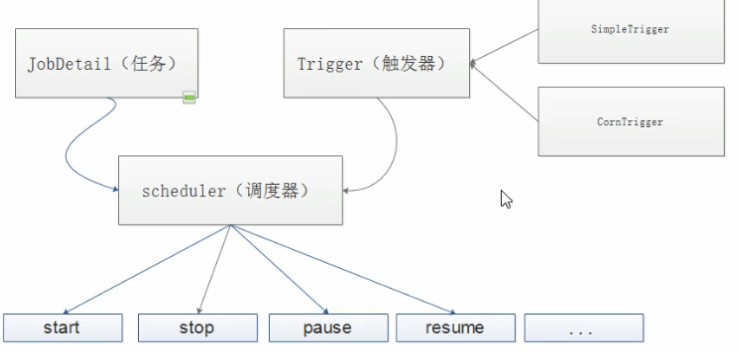
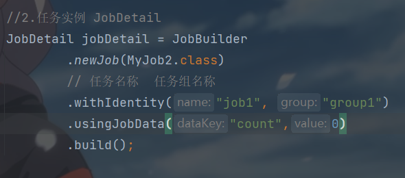
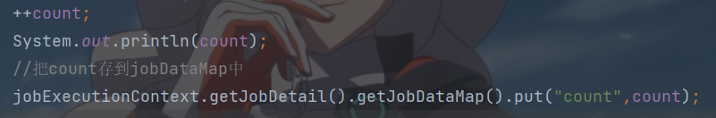
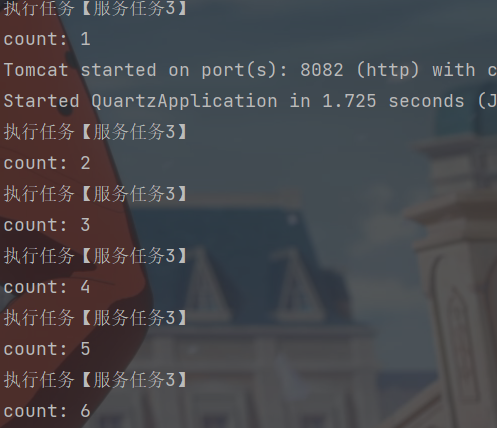
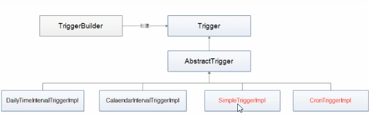
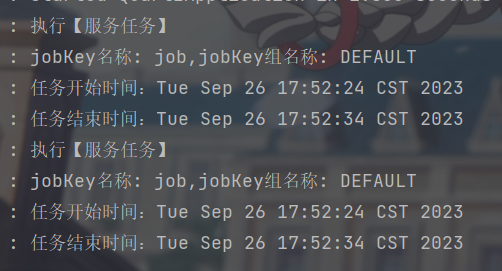

# Quartz任务调度

> 任务日程调度管理组件  基于java实现的任务调度框架
>
> 能够创建简单或复杂的任务调度，几十上百，上万的任务

## 运行环境

- 可以嵌套在另一个独立应用程序

- 可以在应用程序服务器内被实例化，可以通过RMI使用
- 可以被实例化，作为独立项目集群（负载平衡和故障转移功能）用户作业的执行

## 设计模式

Builder模式

Factory模式

组件模式

链式编程

## ✨核心概念

- 任务 Job

你要实现的任务类、每一个Job必须实现 `org.quartz.job`接口，且只需要实现接口定义的 `execute()`方法

- 触发器 Trigger

你执行任务的触发器，比如你想每天定时3点发送一份统计邮件Trigger将会设置3点进行执行该任务。Tigger主要包含SimpleTrigger 和 CronTrigger 两种。关于两者的区别和使用场景。如下

...

- 调度器 Scheduler

任务调度器，将任务Job和触发器Trigger整合起来。负责基于Trigger设定时间来执行Job



## 常用API

- Scheduler 与调度程序交互的主程序接口
  只有安排进执行计划的任务（`scheduler.schedulerJob()`安排进执行执行计划）当它预先定义的执行时间到了的时候任务触发trigger 该任务才会执行
- Job 希望在未来事件能被调度程序执行的任务类，可以自定义
- JobDetail 使用JobDetail类定义定时任务的历史，JobDetail实例是通过JobBuilder类创建的
- JobDataMap 可以包含不限量（序列号的数据对象）在job实例执行的时候，可以使用其中的数据
- Trigger 触发器，用来执行触发job的，当调度了一个job，触发器然后调整它的属性满足job执行的条件。表明任务在上面时候之心。定义了一个已经被安排的任务将会在什么时候执行的事件条件
- JobBuilder 声明一个任务实例，可以定义关于该任务的详情 比如定义任务名，组名等。这个声明的实力将会作为一个实例执行的任务
- TriggerBuilder 触发创建器 用于创建触发器trigger实例
- JobListener、TriggerListener、SchedulerListener 监听器，用于对组件的监听

## 有状态job和无状态job

@PersistJobDataAfterExecution

有状态的job可以理解为多次job调用期间可以持有一些状态信息，这些状态信息存储在jobDataMap中，默认无状态job每次调用时候都会创建一个新的jobDataMap

1. 无状态job

- MySchedule2类



- 自定义job类




每次输出都是1

2. 有状态job 加上 `@PersistJobDataAfterExecution`注解

   



## Tigger（触发器）



- 常用的触发器 SimpleTrigger和CronTrigger
  - jobKey 表示job实例，触发器触发时，指定的job实例会被执行
  - startTime 触发器的时间表，第一次被触发的时间
  - endTime 终止被触发的时间

```java
//3.触发器
        Date statrtDate = DateBuilder.futureDate(3, DateBuilder.IntervalUnit.SECOND);
        Date endDate = DateBuilder.futureDate(13, DateBuilder.IntervalUnit.SECOND);
        Trigger trigger = TriggerBuilder
                .newTrigger()
                // 触发器名称  触发器组组名称
                .withIdentity("job1")
                .withSchedule(SimpleScheduleBuilder.repeatSecondlyForever(5))
                //马上执行
                //.startNow()
                //设置任务开始时间 延迟三秒
                .startAt(statrtDate)
                //设置任务结束时间 延迟十秒
                .endAt(endDate)
                .build();
```

```java
@Slf4j
public class MyTrigger implements Job {
    @Override
    public void execute(JobExecutionContext context) throws JobExecutionException {
        log.info("执行【服务任务】");
        //获取JobKey、startTime、endTime
        Trigger trigger = context.getTrigger();
        log.info("jobKey名称: {},jobKey组名称: {}",trigger.getJobKey().getName(),trigger.getJobKey().getGroup());
        log.info("任务开始时间：{}",trigger.getStartTime());
        log.info("任务结束时间：{}",trigger.getEndTime());
    }
}
```



只输出了两次

### SimpleTrigger触发器

为需要再特定时间/日期启动，并且一个肯呢个的间隔时间重复执行n次的job设计的


- 未来三秒后开始执行

```java
package com.cai.quartz.schedule;

import com.cai.quartz.trigger.MySimpleTrigger;
import org.quartz.*;
import org.quartz.impl.StdSchedulerFactory;
import org.springframework.context.annotation.Configuration;

import java.util.Date;

@Configuration
public class MySimpleSchedule {
    public MySimpleSchedule() throws SchedulerException {
        doSomeThing();
    }

    public void doSomeThing() throws SchedulerException {
        //调度器
        Scheduler scheduler= StdSchedulerFactory.getDefaultScheduler();
        
        //任务实例
        JobDetail jobDetail=JobBuilder
                .newJob(MySimpleTrigger.class)
                .withIdentity("job1")//定义唯一标识
                .build();

        Date startDate = DateBuilder.futureDate(3, DateBuilder.IntervalUnit.SECOND);
        Date endDate=DateBuilder.futureDate(5, DateBuilder.IntervalUnit.SECOND);
        //触发器
        Trigger trigger=TriggerBuilder
                .newTrigger()
                .withIdentity("trigger1")//定义唯一标识
                .startAt(startDate)
                .endAt(endDate)
                .build();

        scheduler.scheduleJob(jobDetail,trigger);
        scheduler.start();
    }
}

```


- 重复执行(每五秒执行一次)

```java
Trigger trigger=TriggerBuilder
                .newTrigger()
                .withIdentity("trigger1")//定义唯一标识
                .startAt(startDate)
                .withSchedule(SimpleScheduleBuilder.repeatSecondlyForever(5))
                .build();
```

- 重复执行指定次数 （每个五秒执行一次重复执行4次）

`.withRepeatCount(3)`默认为0 所以执行四次 重复事件整数需要大于0

```java
//触发器
        Trigger trigger=TriggerBuilder
                .newTrigger()
                .withIdentity("trigger1")//定义唯一标识
                .startAt(startDate)
                .withSchedule(SimpleScheduleBuilder
                        .repeatSecondlyForever(5)
                        .withRepeatCount(3))
                .build();
```

1. SimpleTrigger属性：开始时间、结束时间、重复次数、重复间隔
2. 重复次数可以为0 ，通过为正整数或常量
3. 重复时间间隔属性值大于0 
4. 如果有指定结束事件属性值，则结束事件属性优先重复次数属性

### CronTrigger触发器

按照日程触发任务

比如指定：每个周五中午；从每周一、周三、周五的上午9:00到10:00间隔五分钟触发

- 七个参数

1. Seconds 秒
2. Minutes 分钟
3. Hours 小时
4. Day-of-Month 月中的天
5. Month 月
6. Day of week 周中的天
7. Year


每五秒执行一次


