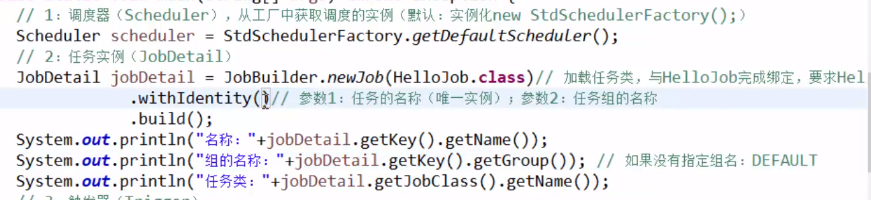
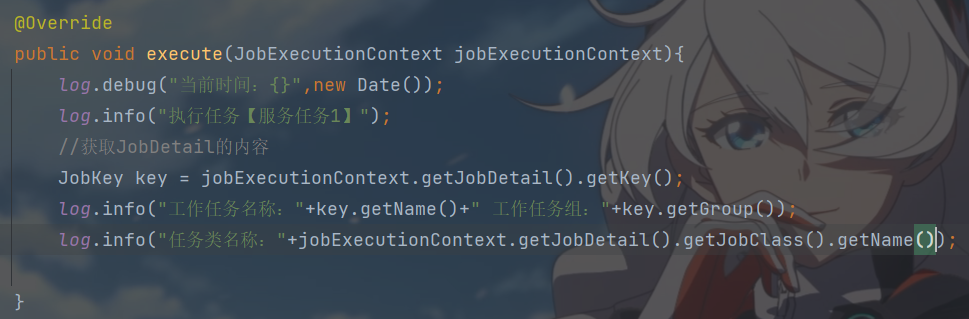
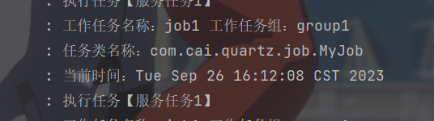
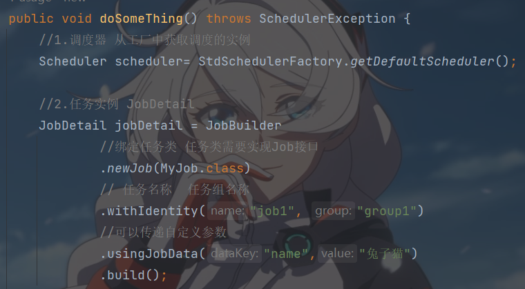
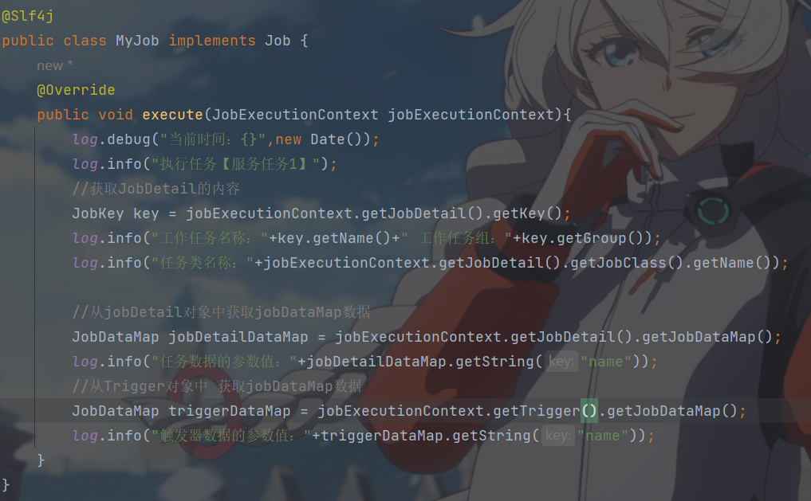
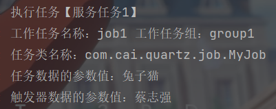

# Quartz

- 依赖

```xml
<!--quartz 核心包-->
<!-- https://mvnrepository.com/artifact/org.quartz-scheduler/quartz -->
<dependency>
    <groupId>org.quartz-scheduler</groupId>
    <artifactId>quartz</artifactId>
    <version>2.3.2</version>
</dependency>

<!--quartz 工具包-->
<!-- https://mvnrepository.com/artifact/org.quartz-scheduler/quartz-jobs -->
<dependency>
    <groupId>org.quartz-scheduler</groupId>
    <artifactId>quartz-jobs</artifactId>
    <version>2.2.1</version>
</dependency>
```

## 默认案例

- 任务调度类

```java
public void doSomeThing() throws SchedulerException {
        //1.调度器 从工厂中获取调度的实例
        Scheduler scheduler= StdSchedulerFactory.getDefaultScheduler();

        //2.任务实例 JobDetail
        JobDetail jobDetail = JobBuilder
                //绑定任务类 任务类需要实现Job接口
                .newJob(MyJob.class)
                // 任务名称  任务组名称
                .withIdentity("job1", "group1")
                .build();
        //3.触发器
        Trigger trigger = TriggerBuilder
                .newTrigger()
                // 触发器名称 触发器组名称
                .withIdentity("trigger1", "group1")
                //马上执行
                .startNow()
                //设定每五秒执行一次
                .withSchedule(
                        SimpleScheduleBuilder
                                .repeatSecondlyForever(5)
                )
                .build();

        //调度器管理任务和触发器，保证按照触发器定义的条件执行任务
        scheduler.scheduleJob(jobDetail,trigger);
        //启动
        scheduler.start();
    }
```

- 自定义任务类

```java
@Slf4j
public class MyJob implements Job {
    @Override
    public void execute(JobExecutionContext jobExecutionContext){
        log.debug("当前时间：{}",new Date());
        log.info("执行任务【服务任务1】");
    }
}
```

> 2023-09-26 15:47:03.498  INFO 14724 --- [eduler_Worker-1] com.cai.quartz.job.MyJob                 : 执行任务【服务任务1】
> 2023-09-26 15:47:08.500 DEBUG 14724 --- [eduler_Worker-2] com.cai.quartz.job.MyJob                 : 当前时间：Tue Sep 26 15:47:08 CST 2023
> 2023-09-26 15:47:08.500  INFO 14724 --- [eduler_Worker-2] com.cai.quartz.job.MyJob                 : 执行任务【服务任务1】
> 2023-09-26 15:47:13.498 DEBUG 14724 --- [eduler_Worker-3] com.cai.quartz.job.MyJob                 : 当前时间：Tue Sep 26 15:47:13 CST 2023
> 2023-09-26 15:47:13.498  INFO 14724 --- [eduler_Worker-3] com.cai.quartz.job.MyJob                 : 执行任务【服务任务1】
> 2023-09-26 15:47:18.498 DEBUG 14724 --- [eduler_Worker-4] com.cai.quartz.job.MyJob                 : 当前时间：Tue Sep 26 15:47:18 CST 2023
> 2023-09-26 15:47:18.498  INFO 14724 --- [eduler_Worker-4] com.cai.quartz.job.MyJob                 : 执行任务【服务任务1】
> 2023-09-26 15:47:23.500 DEBUG 14724 --- [eduler_Worker-5] com.cai.quartz.job.MyJob                 : 当前时间：Tue Sep 26 15:47:23 CST 2023
> 2023-09-26 15:47:23.500  INFO 14724 --- [eduler_Worker-5] com.cai.quartz.job.MyJob                 : 执行任务【服务任务1】
>
> Process finished with exit code 130

## Job和JobDetail

- job

  - 工作任务调度的接口，任务类需要实现该接口，定义接口中定义的`execute()`方法，类似JDK提供的TimeTask类的run方法，在里面编写任务执行的业务逻辑
  - 在Quartz生命周期中，每次调度器执行job时，会调用`execute()`方法前创建一个新的job实例，调用完成后，管理的job对象实例会被释放。释放的实力会被垃圾回收期回收

  > 每次执行任务的时候都会创建新的对象

- JobDetail

  - 提供了许多设置属性和JobDetaMap成员变量属性，用来存储特定job实例的状态信息。调度器需要借助jobDetail对象来添加job实例
  - 重要的属性：`name、group、jobClass、jobDataMap`



没有指定组名称默认为DEFAULT

## JobExecutionContext

- 当Scheduler调用一个job的时候，会把jobExecutionContext传递给Job的execution()方法

- job能通过JobExecutionContext对象访问到Quartz运行时候的环境以及Job本身的明细数据





## JobDataMap

- 在任务调度时，JobDataMap存储在JobExecutionContext中，方便获取
- 可以用来转载任何可以序列化的数据对象，当job实例对象被执行这些参数对象会传递给他。
- jobDataMap实现JDK的Map接口，并且添加了非常方便的方法来存取基本数据类型


传递参数



接收参数



